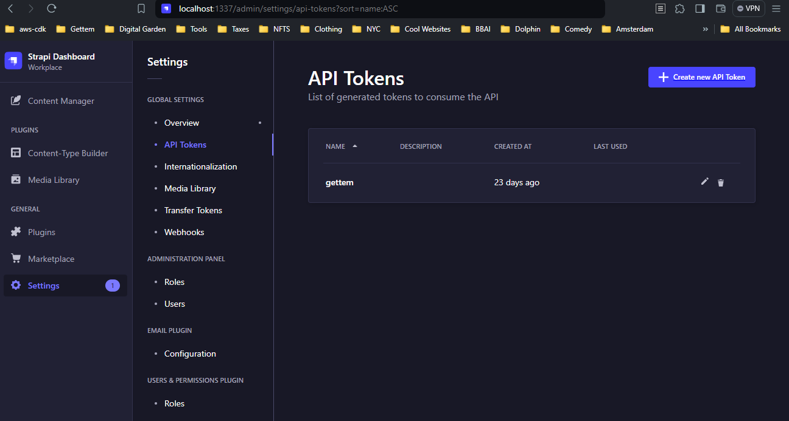

## Gettem
<hr>

The portfolio website source code for https://joneid.dev

<br>

#### Prerequisities  

- Docker

<br>

#### Get Started
1. ##### Clone Repo and Navigate to root dir
```
git clone https://github.com/Jonathan-Eid/gettem.git
cd gettem
```


2. ##### Initiate .env variables
```
cat << EOF >> .env

export ADMIN_JWT_SECRET=YehBmC8QPFQ13SCjGyKd
export API_TOKEN_SALT=pYpQ60YQD3GbQKQdzi5iEd
export APP_KEYS=[bZtVyR443Vo8BhHcKViHgBsVWCcIbYw0FPGYOB]
export STRAPI_URL=http://localhost:1337
export URL=http://localhost:1337

EOF
```
```
source .env
```

2. ##### Start Strapi

```
docker compose up -d strapi
```

3. ##### Create API Token for the Frontend

- Navigate to your strapi instad @ localhost:1337 
- Create your admin account
- Navigate to Settings > API Tokens as shown below:



- Click on "Create new API Token"
- Give your token a name
- Set "Token Type" to "Custom"
- In the "Permissions" section
    - Click on the "Card","Github", "Resume", "Upload" Tabs and select "find" & "findOne"
    - Click on "Content-type-builder" Tab and select "getContentTypes" & "getContentType"
- Save your token and copy the token id
- `echo export STRAPI_AUTH_TOKEN=REPLACE_WITH_TOKEN_ID >> .env`
- `source .env`

4. ##### Start React Frontend

```
docker compose up -d gettem
```
